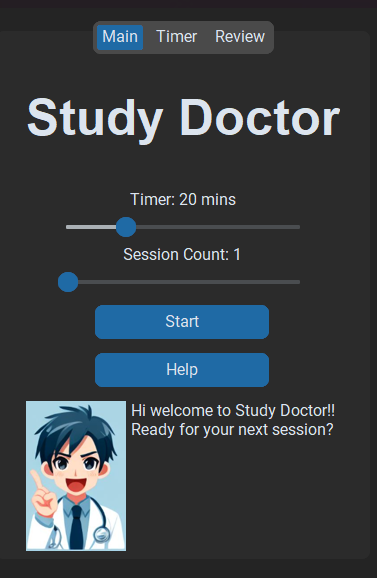

# Study Doctor

## Inspiration
As software engineering and computer science students we ended up having spent a lot of time looking at a screen. Inevitably we strain our eyes from the long hours. To combat this we decided to create an AI companion that helps manage your health as you spend time in front of a screen.

## What it does
Study Doctor helps you keep on track towards having healthier screen time habits by embracing the Pomodoro method as a way to help manage your time more efficiently without burning yourself out. While you are collecting more screen time hours it keeps tabs on important data points that you as the user can check out later to see where you may be lacking. 

## How we built it
- CustomTkinter (Tkinter) as the Interface
- OpenCV (Mediapipe & dlib)

## Challenges we ran into
The toughest challenge we faced as a team was being able to correctly detect certain features of the face.

## Accomplishments that we're proud of
We're proud that we as a team were able to create a functional and presentable proof-of-concept. We were able to implement all the core functionalities that we envisioned at the beginning of DeltaHacks X. We wanted users to have someone be there for them to track their screen time habits and push them in the right direction towards better habits

## What we learned
We learned how to work as a team, how to plan and execute a project within a tight deadline, and how to be adaptable. We preserved through our challenges and because of that, it led to a functional proof-of-concept that solves a real-world problem.

## What's next for Study Doctor
hopefully he gets a full time job! (He's an unpaid intern) ヾ(≧▽≦*)o